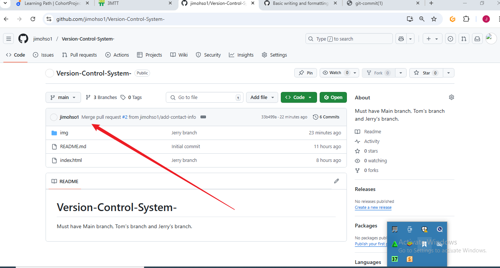

# Version-Control-System-
Must have Main branch, Tom's branch and Jerry's branch.
## In this project, I make sure I carry out the following task:

* Create a repository on GitHub;

* Clone a repository to my machine;

* HTML file is created;

* Main branch is maintained on the terminal

* Tom worked on his branch, makes changes and pull

* Jerry worked on his branch, makes changes and pull

* The three branches were created succesfully

* Pull request was made and merged succesfully

